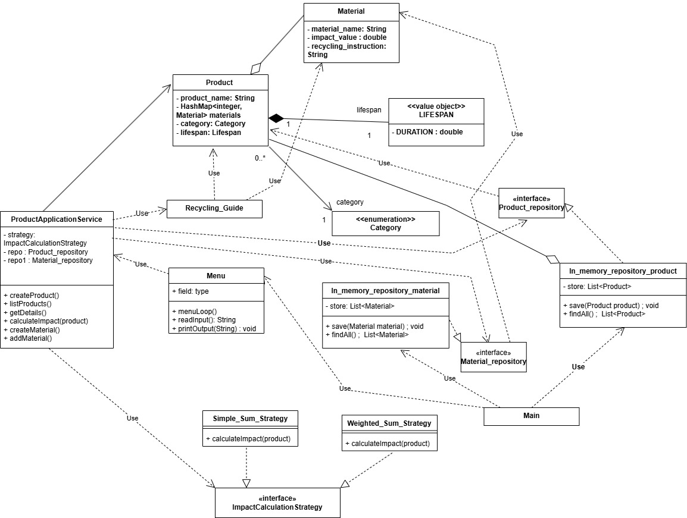
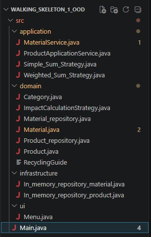

## Sustainable Product and Recycling Management System

---

## Team Members & Roles

* Timothy Juma – Material domain & services
* Karla Kanizaj – Impact calculation strategies
* Peniel Mensah – Architecture & UML diagrams
* Jannatul Bushra – Testing & CI setup

## Project Overview

This project is a console-based application designed to support sustainable consumption and production (SDG 12). The system manages products and materials, calculates environmental impact using interchangeable strategies, and provides recycling guidance.

The focus is on object-oriented design, clean architecture, and testability.

---

## Objectives

* Apply object-oriented design principles
* Implement the Strategy pattern for impact calculation
* Separate business logic from presentation (console UI)
* Ensure testability with unit tests
* Use professional Git workflow and CI practices

---

## Core Features

* Product management (create, list, view details)
* Material management (define reusable materials)
* Environmental impact calculation (multiple strategies)
* Recycling guidance for single and mixed materials

---

## Architecture

The system follows a layered architecture:

* **Presentation Layer**: Console-based UI (menus, input/output)
* **Application Layer**: Services handling use cases
* **Domain Layer**: Core business logic and models

---

## Development Plan Week 1

## Git Workflow

* `main` branch is protected
* All work is done in feature branches
* Pull Requests are required for merging
* At least one approval is required before merge

### Branch naming :

* `feature/product-management`
* `feature/material-model`
* `docs/requirements`
* `docs/uml-diagram`

---

### Functional

* Create product
* Assign materials to product
* Define material with impact value
* Calculate environmental impact
* Provide recycling guidance
* List and view products

### Non-functional

* Console-based application
* Testable and maintainable design
* Clear separation of concerns
* Continuous Integration required

---

## Development Plan

* Week 1–3: Analysis, design, and architecture (no business logic)
* Week 4+: Implementation and testing

---

## Documentation

* UML class diagram
* Sequence diagram
* Strategy pattern explanation

---

## Development Plan Week 2
 
 

## Class and responsibilities sentences
---------------------------

### Product 
Represents a physical item in the recycling system, encapsulating its identity and composition. It owns its name, category, lifespan, and the list of materials it is made of. Product does not calculate impact or provide recycling guidance, it delegates those responsibilities to the appropriate services.

### Material 
Is a reusable domain concept representing a physical substance and its environmental recyclability profile. It owns its name, impact value, and recycling category/instruction. Material does not calculate or derive anything, it simply exposes its properties for others to use.

### ImpactCalculationStrategy 
Is a contract that defines interchangeable environmental impact calculation rules. It declares a single method for calculating the impact of a product based on its materials. It does not implement any logic itself, concrete classes implement and override this method to provide specific calculation strategies.

### RecyclingGuide 
Is responsible for providing recycling guidance for single and mixed materials. It simply takes in an input in the form of material(s) and gives a recommendation or guidance in return. It does not handle user interaction or presentation concerns, those belong to the presentation layer.

### Category 
Represents the classification of a material within the recycling domain. It owns a single descriptive value that identifies the material type. It has no identity of its own and does not perform any logic, it exists purely as an immutable data descriptor.

### Lifespan 
Represents the estimated durability of a product over time. It owns a single value expressing duration. It has no identity of its own and does not perform any logic, it exists purely as an immutable data descriptor attached to a Product.

## Product – CRC Card
### Responsibilities:
Knows name, category, lifespan, materials
Provides material list for impact calculation

### Collaborators:
Material
ImpactCalculationStrategy
RecyclingGuide

## Material – CRC Card
### Responsibilities:
Knows name, impact value, recycling category/instruction
Exposes its properties for others to use

#### Collaborators:
Product
RecyclingGuide

## ImpactCalculationStrategy – CRC Card
### Responsibilities:
Defines contract for calculating environmental impact
Declares method all strategies must implement

### Collaborators:
Product
Material

## RecyclingGuide – CRC Card
### Responsibilities:
Provides recycling guidance for single and mixed materials
Takes material(s) as input and returns guidance

### Collaborators:
Material

## Week 3: Design rationale

### UML diagram V2
 
 

Association relationship between Product class and ProductApplicationService has been reversed, now the relationship indicates that ProductApplicationService uses instances of Product. Keep in mind that while not defined, the relationship between ProductApplicationService class and Product class is also a usage dependency relationship and a creation dependency relationship.

Our former App class violated DIP from the UML week2. App (merged into Product ApplicationService now) should not depend on Menu, as App is a high-level module and Menu is a low-level module. This violates DIP. The changes we have made are: 
1. App class no longer exists as it is merged into ProductApplicationService.
2. Menu is the one depending on Product ApplicationService.
3. Product ApplicationService depends on interfaces Material_repository and Product_repository (both are abstractions). We are using a constructor injection to provide dependencies (instances of both interfaces) to Product ApplicationService. 

The listed changes are visible in our updated UML. However, one of the potential on-going issues in the updated UML is that SRP might still be violated in ProductApplicationService due to improper separation of concerns (by adding methods belonging to MaterialService). If that is the case, then we are mixing two different responsibilities (handle methods related to Product class & handle methods related to Material class). In such a case, we have thought of a potential improvement to the UML diagram: 
1. Add MaterialService class.
2. Move createMaterial() from ProductApplicationService to MaterialService. Now MaterialService will take care of adding materials to the list of possible reusable materials, while ProductApplicationService will take care of methods related to the Product class. The reason for this is because we have not found information on if we are not allowed to inject objects into other classes muiltiple times if need be.
3. Add repo1 (derived from Material_repository abstract interface) as a field to MaterialService. MaterialService will need access to the material repository in order to perform its method.

Whether we decide to move forward with this change is going to depend on the Week3 project meeting. 

Additionally, on Lecture 3 slides, page 20, there are examples for each protocol applied that need to be in our new UML diagram. These statements are true for our program: 
1. Product is a domain concept — it does not calculate impact scores or render UI (satisfies SRP).
2. A new impact strategy is a new class — existing classes require no modification (satisfies OCP).
3. The application depends on the ImpactCalculationStrategy interface, not any concrete implementation (satisfies DIP).

## Week 4: Explanation of architectural decisions

 
 

### 1.
#### domain/
Category.java,
ImpactCalculationStrategy.java,
Material_repository.java,
Material.java,
Product_repository.java,
Product.java,
RecyclingGuide.java

#### application/
MaterialService.java,
ProductApplicationService.java,
Simple_Sum_Strategy.java,
Weighted_Sum_Strategy.java

#### presentation/
Menu.java

### 2.	ImpactCalculationStrategy interface 
Impacts our business rules, and since it does, it belongs in the domain layer. If a class/interface contains business rules (calculates impact of product), the result of what we are trying to achieve is usually affected (the impact value of product will change depending on which implemented class we decide to inject into ProductApplicationService) and the way the result is reached is affected (we are likely going to do calculations with different fields/attributes to achieve different values).

####  Material_repository & Product_repository interface 
Repository interfaces; part of domain, implemented in infrastructure. Thanks to the interface declaration in the domain layer, detailed implementation in the infrastructure layer can be flexibly modified without worrying about changing domain logic. The domain layer should not be concerned with persistence (how), only indicate what the program needs to run (like ingredients in a fridge). Repository interfaces are implemented in the infrastructure layer because the domain layer should be the most stable out of all of our layers, so ideally we should build around it and not change their existing entities. Having repositories as interfaces inside of the domain layer contributes to loose coupling and abstraction purposes. Tightly coupled code relies on a concrete implementation, but loosely coupled code relies on abstraction. Our high level modules (belonging to application layer/domain layer) should depend on abstractions.

### 3.	Dependency direction of ImpactCalculationStrategy 
ProductApplicationService receives an ImpactCalculationStrategy via its constructor — this is an example of constructor injection. This way we are also respecting the dependency inversion of Application layer depending on Domain layer, as an interface belongs to the caller (in this case Domain layer) and not implementer (in our case Application layer). 

#### Dependency direction of Material_repository 
MaterialService receives an Material_repository via its constructor (constructor injection). Respects the dependency inversion: Application layer depends on Domain layer, as an interface belongs to the caller (in this case Domain layer) and not implementer (in our case Infrastructure layer). 

#### Dependency direction of Product_repository 
ProductApplicationService receives a Product_repository via its constructor (constructor injection). Respects the dependency inversion: Application layer depends on Domain layer, as an interface belongs to the caller (in this case Domain layer) and not implementer (in our case Infrastructure layer). 
