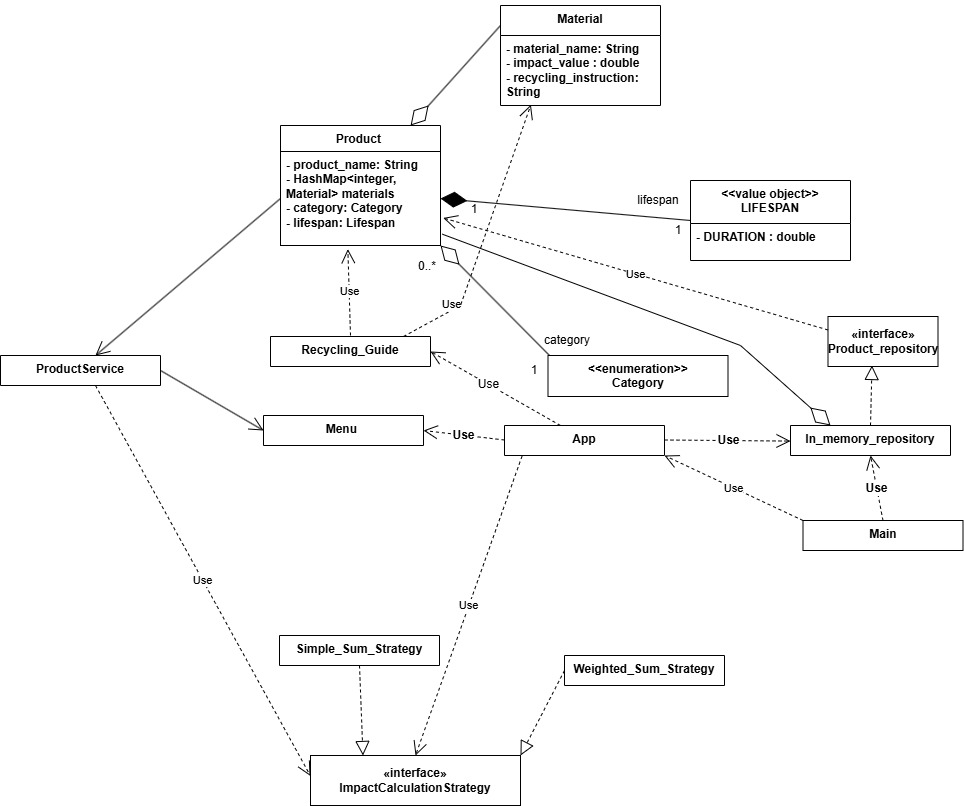

# Sustainable-Product-and-Recycling-Management-System-
This project describes the final project for the course. The focus is on object-oriented design, test-driven development, and professional development practices. The application shall be implemented as a structured, menu-driven console program 

