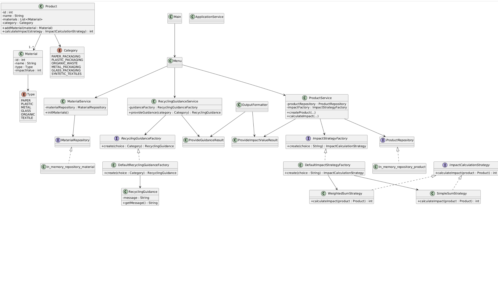

## Sustainable Product and Recycling Management System

---

## 1.  Team Members & Roles

* Timothy Juma – Testing & CI setup
* Karla Kanizaj – Design patterns (impact calculation and recycling guidance), Product domain & services
* Peniel Mensah – Architecture & UML diagrams
* Jannatul Bushra – Material domain & services

## 2. Project Overview

This project is a console-based application designed to support sustainable consumption and production (SDG 12). The system manages products and materials, calculates environmental impact using interchangeable strategies, and provides recycling guidance.  
The focus is on object-oriented design, clean architecture, and testability.

---

## 3. Objectives

* Apply object-oriented design principles
* Implement the Strategy pattern for impact calculation
* Separate business logic from presentation (console UI)
* Ensure testability with unit tests
* Use professional Git workflow and CI practices

---

## 4. Core Features

* Product management (create, list, view details)
* Material management (define reusable materials)
* Environmental impact calculation (multiple strategies)
* Recycling guidance for single and mixed materials

---
## 5. Technology Stack

| Component | Technology |
|-----------|------------|
| Language | Java 21 |
| Build Tool | Gradle |
| Testing | JUnit 5 |
| CI/CD | GitHub Actions |
| Design Modeling | UML / PlantUML |

---

## 6. Building the Project

### Prerequisites

- Java 21 or later
- Gradle 8+ (or Gradle Wrapper)

### Build

```bash
./gradlew build
```

The build process compiles the application and executes all automated tests.

---

## 7. Running the Application

```bash
./gradlew run
```

The application starts a console-based interface that allows users to manage products, materials, environmental impact calculations, and recycling guidance.

---

## 8. Architectural Overview

The system follows a layered architecture to separate responsibilities and improve maintainability.

### Presentation Layer

Responsible for user interaction.

Examples:

- Menu
- OutputFormatter
- Console UI classes

Responsibilities:

- Receive user input
- Display output
- Delegate business operations to services

### Application Layer

Coordinates use cases and business workflows.

Examples:

- ProductService
- MaterialService
- RecyclingGuidanceService

Responsibilities:

- Execute business operations
- Validate requests
- Coordinate domain objects

### Domain Layer

Contains core business rules and entities.

Examples:

- Product
- Material
- RecyclingGuidance
- ImpactCalculationStrategy

Responsibilities:

- Business logic
- Domain validation
- Environmental impact calculations

### Infrastructure Layer

Provides technical implementations.

Examples:

- In-memory repositories
- Repository implementations
- Data persistence support

Responsibilities:

- Data storage
- Repository implementations
- External integrations

---
## 9. Strategy Design Pattern

### Purpose

The Strategy Pattern allows the application to switch environmental impact calculation algorithms at runtime without changing the client code.

### Strategy Interface

```java
ImpactCalculationStrategy
```

The interface defines the contract used by all environmental impact calculation algorithms.

### Concrete Strategies

Examples:

- SimpleSumStrategy
- WeightedSumStrategy

Each strategy implements a different environmental impact calculation method.

### Factory Integration

The project uses:

```java
ImpactStrategyFactory
DefaultImpactStrategyFactory
```

The factory selects and creates the appropriate strategy implementation.

### Workflow

1. User selects a calculation method.
2. Factory creates the required strategy.
3. ProductService receives the strategy.
4. Strategy performs the calculation.
5. Result is returned to the user.

### Benefits

- Open/Closed Principle compliance
- Easy addition of new algorithms
- Reduced coupling
- Improved maintainability
- Better unit test coverage

---

## 10. Design Principles Applied

### SOLID Principles

#### Single Responsibility Principle

Each class has a focused responsibility.

#### Open/Closed Principle

New calculation strategies can be added without modifying existing services.

#### Dependency Inversion Principle

Services depend on interfaces rather than concrete implementations.

### Separation of Concerns

The application separates:

- User Interface
- Business Logic
- Domain Rules
- Data Access

---

## 11. Diagrams

### 11. 1 UML Class Diagram
Location:

```text
docs/requirements/conceptual_uml_class_diagram.png
```
<br>
<br>


## Class and responsibilities sentences
---------------------------

### Product 
Represents a physical item in the recycling system, encapsulating its identity and composition. It owns its name, category, lifespan, and the list of materials it is made of. Product does not calculate impact or provide recycling guidance, it delegates those responsibilities to the appropriate services.

### Material 
Is a reusable domain concept representing a physical substance and its environmental recyclability profile. It owns its name, impact value, and recycling category/instruction. Material does not calculate or derive anything, it simply exposes its properties for others to use.

### ImpactCalculationStrategy 
Is a contract that defines interchangeable environmental impact calculation rules. It declares a single method for calculating the impact of a product based on its materials. It does not implement any logic itself, concrete classes implement and override this method to provide specific calculation strategies.

### RecyclingGuide 
Is responsible for providing recycling guidance for single and mixed materials. It simply takes in an input in the form of material(s) and gives a recommendation or guidance in return. It does not handle user interaction or presentation concerns, those belong to the presentation layer.

### Category 
Represents the classification of a material within the recycling domain. It owns a single descriptive value that identifies the material type. It has no identity of its own and does not perform any logic, it exists purely as an immutable data descriptor.

### Lifespan 
Represents the estimated durability of a product over time. It owns a single value expressing duration. It has no identity of its own and does not perform any logic, it exists purely as an immutable data descriptor attached to a Product.

## Week 3: Design rationale

### 11. 2 UML diagram V2
<br>
<br>


Association relationship between Product class and ProductApplicationService has been reversed, now the relationship indicates that ProductApplicationService uses instances of Product. Keep in mind that while not defined, the relationship between ProductApplicationService class and Product class is also a usage dependency relationship and a creation dependency relationship.


Our former App class violated DIP from the UML week2. App (merged into Product ApplicationService now) should not depend on Menu, as App is a high-level module and Menu is a low-level module. This violates DIP. The changes we have made are: 
1. App class no longer exists as it is merged into ProductApplicationService.
2. Menu is the one depending on Product ApplicationService.
3. Product ApplicationService depends on interfaces Material_repository and Product_repository (both are abstractions). We are using a constructor injection to provide dependencies (instances of both interfaces) to Product ApplicationService. 

The listed changes are visible in our updated UML. However, one of the potential on-going issues in the updated UML is that SRP might still be violated in ProductApplicationService due to improper separation of concerns (by adding methods belonging to MaterialService). If that is the case, then we are mixing two different responsibilities (handle methods related to Product class & handle methods related to Material class). In such a case, we have thought of a potential improvement to the UML diagram: 
1. Add MaterialService class.
2. Move createMaterial() from ProductApplicationService to MaterialService. Now MaterialService will take care of adding materials to the list of possible reusable materials, while ProductApplicationService will take care of methods related to the Product class. The reason for this is because we have not found information on if we are not allowed to inject objects into other classes muiltiple times if need be.
3. Add repo1 (derived from Material_repository abstract interface) as a field to MaterialService. MaterialService will need access to the material repository in order to perform its method.

Whether we decide to move forward with this change is going to depend on the Week3 project meeting. 

Additionally, on Lecture 3 slides, page 20, there are examples for each protocol applied that need to be in our new UML diagram. These statements are true for our program: 
1. Product is a domain concept — it does not calculate impact scores or render UI (satisfies SRP).
2. A new impact strategy is a new class — existing classes require no modification (satisfies OCP).
3. The application depends on the ImpactCalculationStrategy interface, not any concrete implementation (satisfies DIP).


## 12. Explanation of architectural decisions

<br>
<br>


### 1.
#### domain/
Category.java,<br> 
ImpactCalculationStrategy.java, <br>
Material_repository.java, <br>
Material.java, <br>
Product_repository.java, <br>
Product.java, <br>
RecyclingGuide.java <br>

#### application/
MaterialService.java, <br>
ProductApplicationService.java, <br>
Simple_Sum_Strategy.java, <br>
Weighted_Sum_Strategy.java <br>

#### presentation/
Menu.java <br>

#### infrastructure/
In_memory_repository_product.java <br>
In_memory_repository_material.java <br>

#### Our composition root -> Main.java

### 2.	ImpactCalculationStrategy interface 
Impacts our business rules, and since it does, it belongs in the domain layer. If a class/interface contains business rules (calculates impact of product), the result of what we are trying to achieve is usually affected (the impact value of product will change depending on which implemented class we decide to inject into ProductApplicationService) and the way the result is reached is affected (we are likely going to do calculations with different fields/attributes to achieve different values).

####  Material_repository & Product_repository interface 
Repository interfaces; part of domain, implemented in infrastructure. Thanks to the interface declaration in the domain layer, detailed implementation in the infrastructure layer can be flexibly modified without worrying about changing domain logic. The domain layer should not be concerned with persistence (how), only indicate what the program needs to run (like ingredients in a fridge). Repository interfaces are implemented in the infrastructure layer because the domain layer should be the most stable out of all of our layers, so ideally we should build around it and not change their existing entities. Having repositories as interfaces inside of the domain layer contributes to loose coupling and abstraction purposes. Tightly coupled code relies on a concrete implementation, but loosely coupled code relies on abstraction. Our high level modules (belonging to application layer/domain layer) should depend on abstractions.


### 3.	Dependency direction of ImpactCalculationStrategy 
ProductApplicationService receives an ImpactCalculationStrategy via its constructor — this is an example of constructor injection. This way we are also respecting the dependency inversion of Application layer depending on Domain layer, as an interface belongs to the caller (in this case Domain layer) and not implementer (in our case Application layer). 

#### Dependency direction of Material_repository 
MaterialService receives an Material_repository via its constructor (constructor injection). Respects the dependency inversion: Application layer depends on Domain layer, as an interface belongs to the caller (in this case Domain layer) and not implementer (in our case Infrastructure layer). 

#### Dependency direction of Product_repository 
ProductApplicationService receives a Product_repository via its constructor (constructor injection). Respects the dependency inversion: Application layer depends on Domain layer, as an interface belongs to the caller (in this case Domain layer) and not implementer (in our case Infrastructure layer). 

## Week 5 - Console UI and Separation of Concerns
No required deliverables for documentation other than the code.

## Week 6 - Code Review & Design Refinement

Unfortunately, it was difficult to pinpoint exactly who worked on each implementation detail, as up until this point we have had our development process mostly in our Whatsapp group and meetings on GoogleMeet. However, we had been working together, splitting up when needed to help implement a functionality to our program as soon as possible. Once the transfer of our latest code is added to our Github repository, we will continue working through Github codespaces. For this week’s deliverables, we have focused on refactoring changes that need to happen in both versions of our code (the one uploaded to Github), and the latest version of the code that we have posted in the Whatsapp group.  

### Responsibilities:

#### Does each class have exactly one reason to change? 

Paniel: Yes, aside from MaterialService class. A domain class should not not calculate anything or interact with the UI. A good example of a class with a clean single responsibility is Product class, while MaterialService class mixes presentation (formatting) and application layer concerns (handling operations related to Material objects).

Timothy: Not Completely. Classes like CreateProductResult, DisplayProductDetailsResult and ProvideGuidanceResult exist mainly to support workflows/output handling. This leads to the spread of responsibilities across classes. Much better way will be having clearer single responsibilities like: Menu → user interaction, ProductApplicationService → orchestrates use cases, Product/Material → domain data + behavior, strategy classes → impact calculation only, repositories → data storage only.

Karla: Only MaterialService violates SRP, as its responsibilities are now too many. In listMaterials(), it formats information before returning it and the class itself is otherwise responsible for containing methods which handle Material objects (and need access to the material repository).

Bushra: Most classes follow the Single Responsibility Principle well. Result classes such as ProvideGuidanceResult, CreateProductResult, ListProductsResult, and DisplayProductDetailsResult are only responsible for transferring data between layers and do not contain business logic. ProductService is mainly responsible for product-related operations such as creating products, finding products, and adding materials to products.  ApplicationService now acts mostly as an orchestration layer between services, which is an improvement compared to the previous structure. However, it still contains some data conversion responsibilities that could later be moved into separate mapper or presenter classes.

### What to refactor for this week - group conclusion: 

Classes like CreateProductResult, DisplayProductDetailsResult and ProvideGuidanceResult do not contain business logic, and they are considered to be Data Transfer Objects (DTOs). Their only responsibility is to transfer data between the application layer and the presentation layer, hence they do not violate SRP. MaterialService violates SRP in listMaterials(), since it contains presentation layer formatting. We have decided to do a refactor for this method, where we will add a DTO object between MaterialService class and Menu class. When it comes to ApplicationService dealing with conversions such as converting String to UUID value or from UUID value to String, these are the reasons behind why they exist in the implementation of our program:
The unique identifier of each Product object is its ID. 
in order for the user to refer to a certain Product, they would need to input its id value, which would first be a String that gets converted to a UUID.
In order for ApplicationService to pass values to DTO objects, Product IDs are converted from UUID value to String form, which helps avoid making DTO objects unnecessarily depend on the UUID class.

#### Are method names specific enough to describe a single action?

Peniel: Yes. Methods like createMaterial(), initMaterials(), and find_Material() are easy to understand. Even though some names use snake case, the meaning is still clear.

Timothy: No. Some methods have mixed responsibilities. A better way will be using focused methods like calculateImpact(), addProduct(), findById() instead of broad workflow-style methods.

Bushra: Yes. Method names clearly describe their responsibilities and improve readability. Examples include: provideGuidance(), displayProductDetails(), createProduct(), assignCategoryToProduct(), addMaterialtoProduct(), etc… These methods each represent a single, understandable action, making the code easier to maintain and follow.

Karla: Yes, while going through the entirety of the program, I would have to say that the method names are generally descriptive and make their responsibilities easy to understand, which helped with my understanding of how far along in our project we have progressed and how much we still have to expand. Methods in ApplicationService such as provideGuidance(), displayProductDetails(), listPredefinedMaterials(), assignCategoryToProduct(), and addMaterialToProduct() clearly indicate the specific action each method performs. Additionally, methods createMaterial(), initMaterials(), and find_Material() from MaterialService are straightforward and self-explanatory. Even if there are a few inconsistencies with the expected Upper CamelCase naming convention, the method names still effectively communicate their purpose, making the code easy to follow and maintain.

### Layer integrity

#### Does any domain class import from the presentation layer?

Bushra: No. The uploaded classes do not contain presentation-layer dependencies such as Scanner, System.in, or direct console interaction. This indicates good separation between presentation logic and business logic. The domain and application layers remain independent from UI concerns, which helps preserve clean architecture principles. 

Paniel: No. For example, the Material class only imports: import com.mightyfour.domain.Type; It does not import: import com.mightyfour.presentation.Menu; This shows a clean separation between domain and UI.

Timothy: No. The domain layer remains independent and does not import any classes from the presentation layer. This ensures that business rules are not coupled to the user interface and helps maintain a clear layered architecture.

Karla: No, the domain layer stays independent. It does not import any classes from the presentation layer.

#### Is business logic kept out of the console/UI classes?

Group conclusion: Yes. The UI layer simply calls the services. For example; menu.menuLoop(). It does not calculate anything or manage data. The presentation layer is responsible only for handling user input and displaying output. Business operations are delegated to the application and domain layers, which helps maintain separation of concerns and makes the system easier to maintain and test. Additionally, the presentation layer is not aware of the domain objects or any business logic or rules. We believe our presentation layer is very clean in the view of object oriented design.

### Coupling

#### How many classes change if Material is renamed? 

Group conclusion: If we renamed Material to RecyclableItem, then classes such as: Product, MaterialService, and In memory repository material would need updating. This is normal for a core domain class.

#### Are collaborators injected (good) or instantiated inside (bad)?

Group conclusion: Yes. Collaborators are injected following the Dependency Inversion Principle (DIP) dependency injections, via a dependency injection technique. For example: MaterialService materialService = new MaterialService(repo1); This avoids hard-coded dependencies and makes testing easier. 

### Testability 

#### Could calculateImpact() be tested without a Scanner? 

Group conclusion: Yes. Scanner is only used in the presentation layer (and in infrastructure during instantiation).

#### Are there any static utility calls buried in domain logic? 

Group conclusion: No. There are no static utility calls, no printing, and no random behavior inside the domain or service classes. The code relies mainly on service collaboration and repository access rather than hidden static dependencies. This keeps the code predictable and easy to test.

## Week 7 - Design patterns

### Strategy Pattern

The main issue we faced was that the environmental impact calculation is not a fixed
formula, as we are aware that over time we are going to introduce at least two different types of formulas. If we had placed all calculation logic directly inside the Product class or inside one
large method, we would quickly end up with a long list of if/switch statements. Every time a new impact calculation method for a Product object is added, we would be forced to modify much of the existing code. This breaks the Open/Closed Principle and makes the system harder to maintain. To avoid this, we introduced the Strategy pattern. Instead of one class trying to
handle every possible calculation, we created separate strategy classes: Simple Sum Strategy
and Weighted Sum Strategy. Each class represents a different algorithm for calculating environmental impact. This isolates the variation point and keeps the rest of the system stable. The pattern was appropriate because the project has different algorithms for the same tasks. Calculation for the class Product is performed separately. With this improvement,the code is flexible, cleaner and there is no SRP Violation. Without the strategy pattern, our program would be tightly coupled, with poor ability to handle scaling of requirements, and a very difficult time testing. 

### Factory Pattern

Because we have applied a Factory pattern to our program, we reduce the amount of code that we will need to modify, therefore most classes will remain untouched (which respects OCP). In the future, if we decide to implement a new ImpactCalculationStrategy class, the only changes necessary will be adding a new class, updating DefaultImpactStrategyFactory class, and updating Menu class in order to communicate to user which calculation strategies are available. The user selects which strategy will be used once they enter 6 in reference to the available options in menuLoop(). The pattern was appropriate in order to successfully implement the workflow for option 6 (calculate impact value of a Product object). We needed to find a way/pattern that would help us keep presentation layer concerns and concerns of other layers separate. As we have two different implementations of ImpactCalculationStrategy that we are going to use interchangeably, one centralized creation point makes the code cleaner. Now all instances of classes that implement ImpactCalculationStrategy are instantiated in the same place (class) and therefore convenient to understand, which means the construction logic is centralized and creation rules are easier to modify. Additionally, all instances of classes that implement ImpactCalculationStrategy are created by calling the same method. This improves SRP and ensures that we do not have multiple creation statements for the same object in different places of our program, which means that the Factory pattern has helped us reduce duplication in our program. Menu knows nothing about ImpactStrategyFactory, SimpleSumStrategy or WeightedSumStrategy, it only passes productId and strategy choice in string form to ApplicationService. Thanks to the Factory pattern, UI classes successfully stay decoupled from concrete types. Without the factory pattern, creation logic would be mixed with UI flow, which weakens the respect for SRP in our program.

## Week 10 - Sequence Diagram and Documentation
This project includes a sequence diagram for the “Calculate Environmental Impact” use case.
The diagram demonstrates how the Presentation layer (`Menu`) communicates with the Application layer (`ApplicationService` and `ProductService`) and finally the Domain layer (`Product`).
The sequence diagram was created directly from the Java implementation to ensure that every lifeline and method call matches the code exactly.
The diagram also models iteration behaviour using a UML `loop` fragment as required in Week 10.

### 13.1  Sequence Diagram 


### 13.2 Sequence Diagram Walkthrough for Calculating Environmental Impact

# Sequence Diagram Walkthrough for Calculating Environmental Impact

## #STEP 1 – User Starts Menu Interaction

### File Location

`app/src/main/java/com/mightyfour/presentation/Menu.java`

### Method

```java
public void menuLoop()
```

### What Happens

* Displays menu options
* Reads user input
* Routes functionality

### Matching Code

```java
user_input = readInput();
```

and

```java
if(user_input.equals("6"))
```

### Explanation

This is the entry point for the environmental impact use case. When the user selects option 6, the Menu class begins the environmental impact workflow.

---

### STEP 2 – Product ID Input

### File Location

`presentation/Menu.java`

### Matching Code

```java
printOutput("Please enter product ID: ");
String productId_string = readInput();
```

### Explanation

The Menu prompts the user for a product identifier. This identifier will be used to retrieve the selected product.

---

### STEP 3 – Menu Requests Product Details

### File Location

`presentation/Menu.java`

### Matching Code

```java
DisplayProductDetailsResult productDetails =
    serviceApp.displayProductDetails(productId);
```

### UML Arrow

```text
Menu -> AppService : displayProductDetails(productId)
```

### Explanation

Before calculating environmental impact, the Menu requests product details from the Application layer. This allows the UI to display the materials contained in the selected product so that the user can provide material weights.

---

### STEP 4 – ApplicationService Retrieves Product Details

### File Location

`application/ApplicationService.java`

### Matching Code

```java
return serviceP.displayProductDetails(productId);
```

### UML Arrow

```text
AppService -> ProductService : displayProductDetails(productId)
```

### Explanation

ApplicationService forwards the request to ProductService, maintaining the layered architecture.

---

### STEP 5 – Product Retrieved From Repository

### File Location

`application/ProductService.java`

### Matching Code

```java
repo.findProduct(productId)
```

### UML Arrow

```text
ProductService -> ProductService : repo.findProduct(productId)
```

### Explanation

The ProductService retrieves the product so that its materials can be displayed to the user.

---

### STEP 6 – Material Weights Input

### File Location

`presentation/Menu.java`

### Matching Code

The Menu collects weights for the materials displayed from the product details.

Example:

```java
materialWeights.put(materialName, weight);
```

### Explanation

The user enters weight values corresponding to the materials in the selected product.

---

### STEP 7 – Strategy Selection

### File Location

`presentation/Menu.java`

### Matching Code

```java
printOutput("Please choose strategy: ");
String strategyNum = readInput();
```

### Explanation

The user selects the impact calculation strategy.

---

### STEP 8 – Menu Delegates Impact Calculation

### File Location

`presentation/Menu.java`

### Matching Code

```java
ProvideImpactValueResult result =
    serviceApp.provideImpactValue(
        productId_string,
        strategyNum,
        materialWeights
    );
```

### UML Arrow

```text
Menu -> AppService :
provideImpactValue(productId, strategyNum, materialWeights)
```

### Explanation

The Presentation layer delegates the calculation request to the Application layer.

---

### STEP 9 – ApplicationService Delegates to ProductService

### File Location

`application/ApplicationService.java`

### Matching Code

```java
return serviceP.calculateImpact(
    productId,
    strategyNum,
    materialWeights
);
```

### UML Arrow

```text
AppService -> ProductService :
calculateImpact(productId, strategyNum, materialWeights)
```

### Explanation

ApplicationService coordinates the workflow and forwards the request to ProductService.

---

### STEP 10 – ProductService Uses Factory

### File Location

`application/ProductService.java`

### Matching Code

```java
factory.create(strategyNum)
```

### UML Arrow

```text
ProductService -> Factory : create(strategyNum)
```

### Explanation

The factory selects the appropriate environmental impact calculation strategy.

---

### STEP 11 – Product Retrieved For Calculation

### File Location

`application/ProductService.java`

### Matching Code

```java
repo.findProduct(productId)
```

### UML Arrow

```text
ProductService -> ProductService : repo.findProduct(productId)
```

### Explanation

The ProductService retrieves the product before passing it to the selected strategy.

---

### STEP 12 – Strategy Calculates Impact

### Matching Code

```java
(factory.create(strategyNum))
    .calculateImpact(
        repo.findProduct(productId),
        materialWeights
    );
```

### UML Arrow

```text
ProductService -> Strategy :
calculateImpact(product, materialWeights)
```

### Explanation

The selected strategy performs the environmental impact calculation using the product information and user-provided material weights.

---

### STEP 13 – Result Returned

### File Location

`application/ProductService.java`

### Matching Code

```java
return new ProvideImpactValueResult(result);
```

### UML Arrow

```text
ProductService --> AppService :
ProvideImpactValueResult
```

### Explanation

The calculated impact value is wrapped in a result object and returned.

---

### STEP 14 – Menu Displays Result

### File Location

`presentation/Menu.java`

### Matching Code

```java
formatter.printImpactValueResult(result);
```

### UML Arrow

```text
Menu -> Menu :
formatter.printImpactValueResult(result)
```

### Explanation

The Presentation layer displays the final environmental impact value to the user.


## 14. Assumptions and Limitations

### Assumptions

- Products contain one or more materials.
- Environmental impact calculations are strategy-driven.
- Data is stored in memory unless persistence is added.

### Limitations

- Console-based interface only.
- No database persistence.
- No authentication or authorization.

---

## 15. Future Enhancements

- Database integration
- Web-based UI
- REST API support
- Additional impact calculation strategies
- Reporting and analytics dashboard
- Recycling compliance tracking

---
### 16 Final Uml Diagram



---

## 17. Conclusion

The Sustainable Product and Recycling Management System demonstrates clean software architecture, object-oriented design, use of the Strategy Pattern, automated testing, and maintainable development practices while addressing sustainability-focused business requirements.


## Week 12: Reflection

When we look back at how this project started, it honestly feels like we were just trying to get things to work. Architecture, patterns, layering, and clean design principles all felt abstract in the beginning. But as the codebase grew, we started to see why these things matter. This reflection is us being honest about what we learned, what we struggled with, and how our design evolved. Layered Architecture Our architecture did not appear perfectly from day one. It evolved commit by commit. Early on, we followed the UML from week 4, which already hinted at a layered structure. But the real understanding came later, when things started breaking. We eventually settled into four clear layers: 

Presentation layer: menu and outputFormatter. These only handle input/output. For example, when the user enters option 5, the menu calls applicationService.provideGuidance() and then passes the result to outputFormatter. 

Application layer: applicationService, productService, materialService, recyclingGuidanceService. These coordinate use cases. 

Domain layer: product, material, category, type, and the strategy interfaces. This is where the actual rules live. 

Infrastructure layer: Contains implementations of interfaces in domain layer.

### Refactor: Splitting ProductApplicationService 
One of the most important improvements we made was splitting productApplicationService into productService and applicationService. The original class had accumulated too many responsibilities: orchestrating use cases, handling product operations, interacting with repositories, assigning categories, and preparing data for the presentation layer. After the refactor, productService became responsible for operations directly related to the product entity, such as retrieving products, adding materials, and formatting product details. Meanwhile, applicationService became the orchestrator of use cases. For example, when creating a product, it retrieves a material from materialService, delegates creation to productService, and then calls recyclingGuidanceService to assign a category. We also updated main accordingly. Instead of instantiating the old productApplicationService, it now creates a productService using repositories, and then creates an applicationService using productService, materialService, and recyclingGuidanceService. The menu class now receives only applicationService, outputFormatter, and scanner, which keeps the presentation layer simple.

### Object-Oriented Design and Clean Architecture 
Many of our decisions were rooted in object-oriented design, even before we fully understood the theory. For example, we moved the logic for checking duplicate materials into the product entity using canAddMaterial(), because the product should know its own rules. 1We also saw clean architecture ideas emerge naturally. The presentation layer never touches domain objects directly. Instead, it communicates through applicationService. The domain layer stays pure and does not depend on anything outside itself. For example, productService depends on productRepository, but the domain classes like product and material do not know anything about repositories. 

### Why RecyclingGuidance Is a Normal Class
We discussed whether recyclingGuidance should be an interface, but for our project it did not make sense. We do not expect multiple implementations. All we need is a single class that returns a guidance message based on the material type’s category. Keeping it as a normal class is the simplest design. What matters is that recyclingGuidanceService depends on an abstraction. We inject a recyclingGuidanceFactory (the interface), and the actual implementation is provided from the outside. When the service needs guidance, it calls factory.create(). This keeps the dependency direction correct. Strategy Pattern The Strategy pattern became necessary when we introduced multiple impact calculation methods. Instead of a giant if-else chain, we created: impactCalculationStrategy with two implementations: simpleSumStrategy, weightedSumStrategy This made the code cleaner and easier to extend. Abstract Factory Pattern We used Abstract Factory in two places: • impactStrategyFactory — creates the correct impact strategy. • recyclingGuidanceFactory — creates the correct recycling guidance object based on material type. Without these factories, the service layer would have turned into a giant switch-case. 

### Technical Debt 
We are not pretending the code is perfect. Some things are still messy: Menu is still too large and handles input validation that could be extracted into helper classes, and error handling is basic. For example, converting a string to a UUID throws exceptions that are caught in the menu instead of being validated earlier. Plus, our naming convention is lower camelCase, but earlier commits were inconsistent before we aligned on it. Additionally, some responsibilities could still be moved to the domain layer. For example: Checking whether a product’s lifespan duration is valid. Verifying that a material name is not empty or malformed. These rules describe what a valid product or material is, so they belong inside the domain layer. 

### What We Learned 
The biggest thing we learned is that architecture is not something you “add at the end.” It grows with the project. Every time we hit a wall, we had to rethink our design. Patterns like Strategy and Abstract Factory stopped being abstract ideas and became tools that solved real problems. In the end, we are proud of how the system turned out. Not because it is perfect, but because we can look at it and say: “Yes, we understand why it looks like this.”


