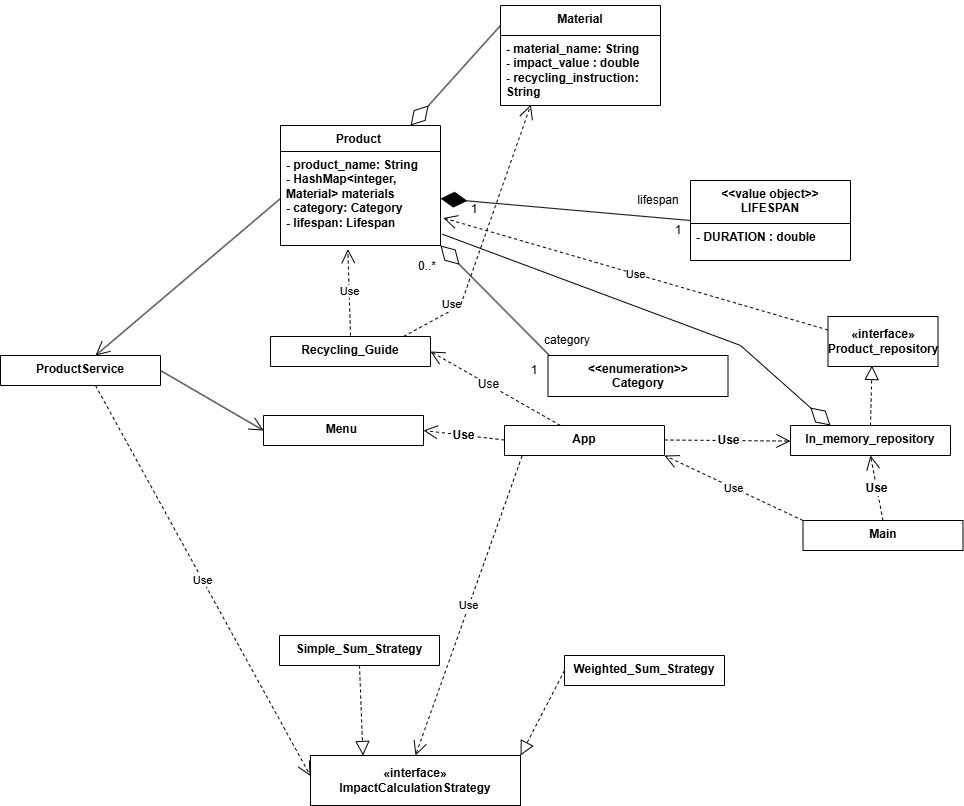
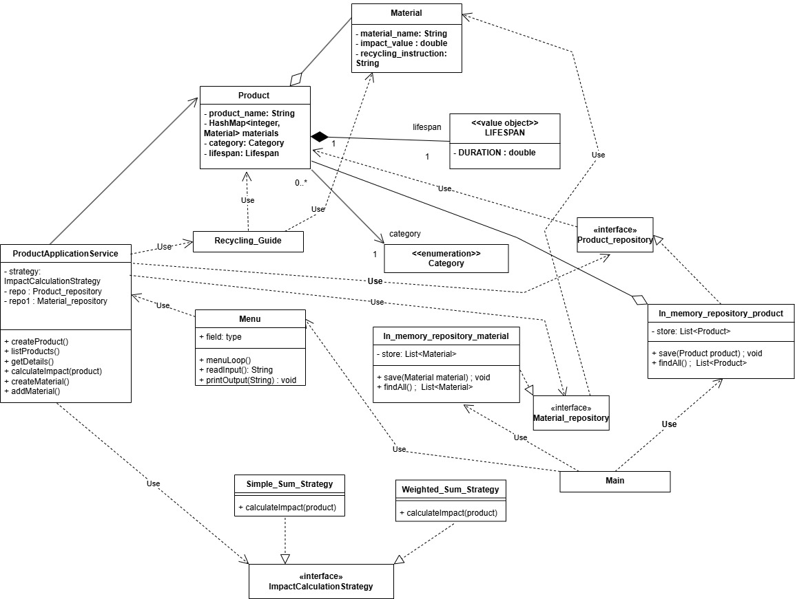
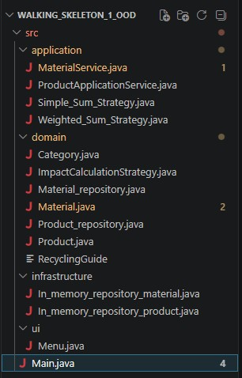
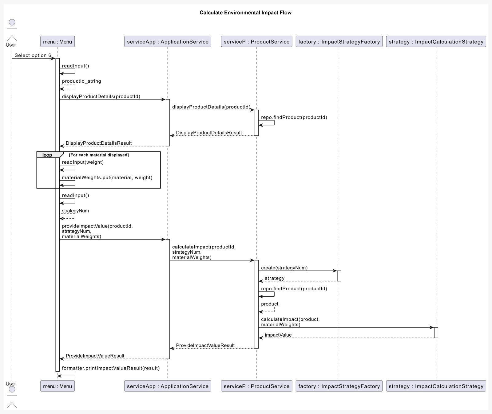

## Sustainable Product and Recycling Management System

---

## 1.  Team Members & Roles

* Timothy Juma – Material domain & services
* Karla Kanizaj – Impact calculation strategies
* Peniel Mensah – Architecture & UML diagrams
* Jannatul Bushra – Testing & CI setup

## 2. Project Overview

This project is a console-based application designed to support sustainable consumption and production (SDG 12). The system manages products and materials, calculates environmental impact using interchangeable strategies, and provides recycling guidance.  
The focus is on object-oriented design, clean architecture, and testability.

---

## 3. Objectives

* Apply object-oriented design principles
* Implement the Strategy pattern for impact calculation
* Separate business logic from presentation (console UI)
* Ensure testability with unit tests
* Use professional Git workflow and CI practices

---

## 4. Core Features

* Product management (create, list, view details)
* Material management (define reusable materials)
* Environmental impact calculation (multiple strategies)
* Recycling guidance for single and mixed materials

---
## 5. Technology Stack

| Component | Technology |
|-----------|------------|
| Language | Java 21 |
| Build Tool | Gradle |
| Testing | JUnit 5 |
| CI/CD | GitHub Actions |
| Design Modeling | UML / PlantUML |

---

## 6. Building the Project

### Prerequisites

- Java 21 or later
- Gradle 8+ (or Gradle Wrapper)

### Build

Linux / macOS

```bash
./gradlew build
```

Windows

```cmd
gradlew.bat build
```

The build process compiles the application and executes all automated tests.

---

## 7. Running the Application

Linux / macOS

```bash
./gradlew run
```

Windows

```cmd
gradlew.bat run
```

The application starts a console-based interface that allows users to manage products, materials, environmental impact calculations, and recycling guidance.

---

## 8. Running Tests

Execute all tests:

```bash
./gradlew test
```

Generate test reports:

```bash
./gradlew test --info
```

---

## 9. Architectural Overview

The system follows a layered architecture to separate responsibilities and improve maintainability.

### Presentation Layer

Responsible for user interaction.

Examples:

- Menu
- OutputFormatter
- Console UI classes

Responsibilities:

- Receive user input
- Display output
- Delegate business operations to services

### Application Layer

Coordinates use cases and business workflows.

Examples:

- ProductService
- MaterialService
- RecyclingGuidanceService

Responsibilities:

- Execute business operations
- Validate requests
- Coordinate domain objects

### Domain Layer

Contains core business rules and entities.

Examples:

- Product
- Material
- RecyclingGuidance
- ImpactCalculationStrategy

Responsibilities:

- Business logic
- Domain validation
- Environmental impact calculations

### Infrastructure Layer

Provides technical implementations.

Examples:

- In-memory repositories
- Repository implementations
- Data persistence support

Responsibilities:

- Data storage
- Repository implementations
- External integrations

---
## 10. Strategy Design Pattern

### Purpose

The Strategy Pattern allows the application to switch environmental impact calculation algorithms at runtime without changing the client code.

### Strategy Interface

```java
ImpactCalculationStrategy
```

The interface defines the contract used by all environmental impact calculation algorithms.

### Concrete Strategies

Examples:

- SimpleSumStrategy
- WeightedSumStrategy

Each strategy implements a different environmental impact calculation method.

### Factory Integration

The project uses:

```java
ImpactStrategyFactory
DefaultImpactStrategyFactory
```

The factory selects and creates the appropriate strategy implementation.

### Workflow

1. User selects a calculation method.
2. Factory creates the required strategy.
3. ProductService receives the strategy.
4. Strategy performs the calculation.
5. Result is returned to the user.

### Benefits

- Open/Closed Principle compliance
- Easy addition of new algorithms
- Reduced coupling
- Improved maintainability
- Better unit test coverage

---

## 11. Design Principles Applied

### SOLID Principles

#### Single Responsibility Principle

Each class has a focused responsibility.

#### Open/Closed Principle

New calculation strategies can be added without modifying existing services.

#### Dependency Inversion Principle

Services depend on interfaces rather than concrete implementations.

### Separation of Concerns

The application separates:

- User Interface
- Business Logic
- Domain Rules
- Data Access

---

## 10. Diagrams

### 10. 1 UML Class Diagram
Location:

```text
docs/requirements/conceptual_uml_class_diagram.png
```
<br>
<br>



## Class and responsibilities sentences
---------------------------

### Product 
Represents a physical item in the recycling system, encapsulating its identity and composition. It owns its name, category, lifespan, and the list of materials it is made of. Product does not calculate impact or provide recycling guidance, it delegates those responsibilities to the appropriate services.

### Material 
Is a reusable domain concept representing a physical substance and its environmental recyclability profile. It owns its name, impact value, and recycling category/instruction. Material does not calculate or derive anything, it simply exposes its properties for others to use.

### ImpactCalculationStrategy 
Is a contract that defines interchangeable environmental impact calculation rules. It declares a single method for calculating the impact of a product based on its materials. It does not implement any logic itself, concrete classes implement and override this method to provide specific calculation strategies.

### RecyclingGuide 
Is responsible for providing recycling guidance for single and mixed materials. It simply takes in an input in the form of material(s) and gives a recommendation or guidance in return. It does not handle user interaction or presentation concerns, those belong to the presentation layer.

### Category 
Represents the classification of a material within the recycling domain. It owns a single descriptive value that identifies the material type. It has no identity of its own and does not perform any logic, it exists purely as an immutable data descriptor.

### Lifespan 
Represents the estimated durability of a product over time. It owns a single value expressing duration. It has no identity of its own and does not perform any logic, it exists purely as an immutable data descriptor attached to a Product.

## Product – CRC Card
### Responsibilities:
Knows name, category, lifespan, materials
Provides material list for impact calculation

### Collaborators:
Material
ImpactCalculationStrategy
RecyclingGuide


## Material – CRC Card
### Responsibilities:
Knows name, impact value, recycling category/instruction
Exposes its properties for others to use

#### Collaborators:
Product
RecyclingGuide


## ImpactCalculationStrategy – CRC Card
### Responsibilities:
Defines contract for calculating environmental impact
Declares method all strategies must implement

### Collaborators:
Product
Material


## RecyclingGuide – CRC Card
### Responsibilities:
Provides recycling guidance for single and mixed materials
Takes material(s) as input and returns guidance

### Collaborators:
Material

## Week 3: Design rationale

### 10. 2 UML diagram V2
<br>
<br>



Association relationship between Product class and ProductApplicationService has been reversed, now the relationship indicates that ProductApplicationService uses instances of Product. Keep in mind that while not defined, the relationship between ProductApplicationService class and Product class is also a usage dependency relationship and a creation dependency relationship.


Our former App class violated DIP from the UML week2. App (merged into Product ApplicationService now) should not depend on Menu, as App is a high-level module and Menu is a low-level module. This violates DIP. The changes we have made are: 
1. App class no longer exists as it is merged into ProductApplicationService.
2. Menu is the one depending on Product ApplicationService.
3. Product ApplicationService depends on interfaces Material_repository and Product_repository (both are abstractions). We are using a constructor injection to provide dependencies (instances of both interfaces) to Product ApplicationService. 

The listed changes are visible in our updated UML. However, one of the potential on-going issues in the updated UML is that SRP might still be violated in ProductApplicationService due to improper separation of concerns (by adding methods belonging to MaterialService). If that is the case, then we are mixing two different responsibilities (handle methods related to Product class & handle methods related to Material class). In such a case, we have thought of a potential improvement to the UML diagram: 
1. Add MaterialService class.
2. Move createMaterial() from ProductApplicationService to MaterialService. Now MaterialService will take care of adding materials to the list of possible reusable materials, while ProductApplicationService will take care of methods related to the Product class. The reason for this is because we have not found information on if we are not allowed to inject objects into other classes muiltiple times if need be.
3. Add repo1 (derived from Material_repository abstract interface) as a field to MaterialService. MaterialService will need access to the material repository in order to perform its method.

Whether we decide to move forward with this change is going to depend on the Week3 project meeting. 

Additionally, on Lecture 3 slides, page 20, there are examples for each protocol applied that need to be in our new UML diagram. These statements are true for our program: 
1. Product is a domain concept — it does not calculate impact scores or render UI (satisfies SRP).
2. A new impact strategy is a new class — existing classes require no modification (satisfies OCP).
3. The application depends on the ImpactCalculationStrategy interface, not any concrete implementation (satisfies DIP).


## 11. Explanation of architectural decisions

<br>
<br>


### 1.
#### domain/
Category.java,<br> 
ImpactCalculationStrategy.java, <br>
Material_repository.java, <br>
Material.java, <br>
Product_repository.java, <br>
Product.java, <br>
RecyclingGuide.java <br>

#### application/
MaterialService.java, <br>
ProductApplicationService.java, <br>
Simple_Sum_Strategy.java, <br>
Weighted_Sum_Strategy.java <br>

#### presentation/
Menu.java <br>

### 2.	ImpactCalculationStrategy interface 
Impacts our business rules, and since it does, it belongs in the domain layer. If a class/interface contains business rules (calculates impact of product), the result of what we are trying to achieve is usually affected (the impact value of product will change depending on which implemented class we decide to inject into ProductApplicationService) and the way the result is reached is affected (we are likely going to do calculations with different fields/attributes to achieve different values).

####  Material_repository & Product_repository interface 
Repository interfaces; part of domain, implemented in infrastructure. Thanks to the interface declaration in the domain layer, detailed implementation in the infrastructure layer can be flexibly modified without worrying about changing domain logic. The domain layer should not be concerned with persistence (how), only indicate what the program needs to run (like ingredients in a fridge). Repository interfaces are implemented in the infrastructure layer because the domain layer should be the most stable out of all of our layers, so ideally we should build around it and not change their existing entities. Having repositories as interfaces inside of the domain layer contributes to loose coupling and abstraction purposes. Tightly coupled code relies on a concrete implementation, but loosely coupled code relies on abstraction. Our high level modules (belonging to application layer/domain layer) should depend on abstractions.


### 3.	Dependency direction of ImpactCalculationStrategy 
ProductApplicationService receives an ImpactCalculationStrategy via its constructor — this is an example of constructor injection. This way we are also respecting the dependency inversion of Application layer depending on Domain layer, as an interface belongs to the caller (in this case Domain layer) and not implementer (in our case Application layer). 

#### Dependency direction of Material_repository 
MaterialService receives an Material_repository via its constructor (constructor injection). Respects the dependency inversion: Application layer depends on Domain layer, as an interface belongs to the caller (in this case Domain layer) and not implementer (in our case Infrastructure layer). 

#### Dependency direction of Product_repository 
ProductApplicationService receives a Product_repository via its constructor (constructor injection). Respects the dependency inversion: Application layer depends on Domain layer, as an interface belongs to the caller (in this case Domain layer) and not implementer (in our case Infrastructure layer). 

## 12 Sequence Diagram and Documentation
This project includes a sequence diagram for the “Calculate Environmental Impact” use case.
The diagram demonstrates how the Presentation layer (`Menu`) communicates with the Application layer (`ApplicationService` and `ProductService`) and finally the Domain layer (`Product`).
The sequence diagram was created directly from the Java implementation to ensure that every lifeline and method call matches the code exactly.
The diagram also models iteration behaviour using a UML `loop` fragment as required in Week 10.

### 12.1  Sequence Diagram 



### 12.2 Sequence Diagram Walkthrough for Calculating Environmental Impact

### Step 1: User Starts Menu Interaction

**File Location:** `app/src/main/java/com/mightyfour/presentation/Menu.java`  
**Method:** `public void menuLoop()`

### What Happens
- Displays menu options
- Reads user input
- Routes functionality

### Matching Code

```java
user_input = readInput();

if (user_input.equals("6"))
```

### Explanation

This is the entry point for the Environmental Impact use case. When the user selects option `6`, the `Menu` class initiates the impact calculation workflow.
The `Menu` belongs to the **Presentation Layer** and is responsible only for coordinating user interaction.

---

## Step 2: Product ID Input

**File Location:** `presentation/Menu.java`

### Matching Code

```java
printOutput("Please enter product ID: ");
String product_Id_string = readInput();
```

### Explanation

The `Menu` prompts the user for a product identifier. The value is stored in `product_Id_string` and passed to the application layer.
In the sequence diagram, this is represented by the self-call responsible for collecting user input.

---

## Step 3: Strategy Input

**File Location:** `presentation/Menu.java`

### Matching Code

```java
printOutput("Please choose strategy: ");
String strategyNum = readInput();
```

### Explanation

The user selects the environmental impact calculation strategy. This value is later forwarded to `ApplicationService`.

---

## Step 4: Menu Delegates to ApplicationService

**File Location:** `presentation/Menu.java`

### Matching Code

```java
ProvideImpactValueResult result =
    serviceApp.provideImpactValue(productId_string, strategyNum);
```

### UML Arrow

```text
Menu -> AppService : provideImpactValue(productId_string, strategyNum)
```

### Explanation

This is the first cross-layer interaction. The Presentation Layer delegates the request to the Application Layer rather than performing any calculations itself.

---

## Step 5: ApplicationService Delegates to ProductService

**File Location:** `application/ApplicationService.java`

**Method**

```java
public ProvideImpactValueResult provideImpactValue(
    String productId_string,
    String strategyNum)
```

### Matching Code

```java
return serviceP.calculateImpact(productId, strategyNum);
```

### UML Arrow

```text
AppService -> ProductService : calculateImpact(productId, strategyNum)
```

### Explanation

`ApplicationService` coordinates the use case and forwards the request to `ProductService`, maintaining a clear separation of concerns.

---

## Step 6: ProductService Uses Factory

**File Location:** `application/ProductService.java`

**Method**

```java
public ProvideImpactValueResult calculateImpact(
    UUID productId,
    String strategyNum)
```

### Matching Code

```java
factory.create(strategyNum);
```

### UML Arrow

```text
ProductService -> Factory : create(strategyNum)
```

### Explanation

The factory selects the appropriate environmental impact calculation strategy.
This demonstrates the use of both the **Factory Pattern** and the **Strategy Pattern**.

---

## Step 7: Product Retrieved from Repository

**File Location:** `application/ProductService.java`

### Matching Code

```java
repo.findProduct(productId);
```

### UML Arrow

```text
ProductService -> ProductService : repo.findProduct(productId)
```

### Explanation

Before calculating the environmental impact, `ProductService` retrieves the product from the repository.

---

## Step 8: Strategy Calculates Impact

### Important Finding
The actual calculation is performed through:
```java
(factory.create(strategyNum))
    .calculateImpact(repo.findProduct(productId));
```
This means that `ProductService` does **not** directly iterate through materials.

### Potential Locations for Calculation Logic

- `application/SimpleSumStrategy.java`
- `application/WeightedSumStrategy.java`

### Explanation
Any loops or calculations involving product materials should be verified inside the strategy implementations.
The sequence diagram should reflect the actual implementation and avoid assuming that iteration occurs within `ProductService`.

---

## Step 9: Result Returned

**File Location:** `application/ProductService.java`
### Matching Code
```java
return new ProvideImpactValueResult(result);
```
### UML Arrow
```text
ProductService --> AppService : ProvideImpactValueResult
```
### Explanation
The calculated environmental impact value is wrapped in a `ProvideImpactValueResult` object and returned to the Application Layer.

---

## Step 10: Menu Displays Result

**File Location:** `presentation/Menu.java`
### Matching Code
```java
formatter.printImpactValueResult(result);
```
### UML Arrow
```text
Menu -> Menu : formatter.printImpactValueResult(result)
```
### Explanation
The Presentation Layer displays the calculated result to the user.
No business logic is executed at this stage; the layer is responsible only for presenting information.

---

## 13. Assumptions and Limitations

### Assumptions

- Products contain one or more materials.
- Environmental impact calculations are strategy-driven.
- Data is stored in memory unless persistence is added.

### Limitations

- Console-based interface only.
- No database persistence.
- No authentication or authorization.

---

## 14. Future Enhancements

- Database integration
- Web-based UI
- REST API support
- Additional impact calculation strategies
- Reporting and analytics dashboard
- Recycling compliance tracking

---

## 15. Conclusion

The Sustainable Product and Recycling Management System demonstrates clean software architecture, object-oriented design, use of the Strategy Pattern, automated testing, and maintainable development practices while addressing sustainability-focused business requirements.


